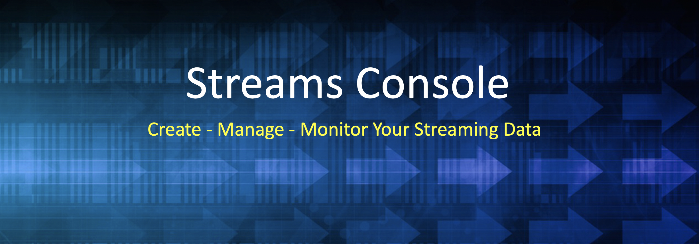

# Streams
Streaming Console

What is InsightLake Streams Console?
-----------

InsightLake Streams Console solution is part of InsightLake Data Platform. It provides an intuitive UI and allows users to manage and govern their streaming data.

Following features are provided:
* Manage multiple Kafka clusters from a centralized console
* Monitor cluster components brokers, zookeepers etc.
* Manage data stores (topics) & schemas easily
* Perform data balancing
* Manage client onboarding
* Manage data connectors
* Explore realtime data
* Perform data transformations
* Apply fine grain security like data masking, tokenization etc
* Monitor JMX 
* Benchmark clusters etc.

Installation
------
* Download or clone the repository. 
* Run bin/insightlake command.
* Open browser with URL as http://localhost:8080/
* Change configuration in /conf folder to set different ports
* By default H2 database is used, you can change the database details in jdbc.properties file

Security
------
* Role based access. 
* LDAP/AD, Kerberos & SSO support.
* Data masking & tokenization
* Audit logs

License
------
InsightLake Data Explorer is a commercial product but distributed to be used freely. Please contact contact@insightlake.com for details.
