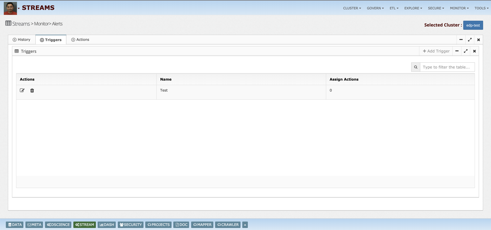

# Streams
Streaming Console

What is InsightLake Streams Console?
-----------

InsightLake Streams Console solution is part of InsightLake Data Platform. It provides an intuitive UI and allows users to manage and govern their streaming data.

Following features are provided:
* Manage multiple Kafka clusters from a centralized console
* Monitor cluster components brokers, zookeepers etc.
* Manage data stores (topics) & schemas easily
* Perform data balancing
* Manage client onboarding
* Manage data connectors
* Build streaming data flows quickly
* Explore realtime data
* Perform data transformations
* Apply fine grain security like data masking, tokenization etc
* Monitor JMX 
* Benchmark clusters etc.

Installation
------
* Download or clone the repository. 
* Run bin/insightlake command.
* Open browser with URL as http://localhost:8080/
* Change configuration in /conf folder to set different ports
* By default H2 database is used, you can change the database details in jdbc.properties file

Installation using docker 
------
* Download or clone the repository. 
* cd docker
* docker-compose -f docker-compose.yaml up --build
* Open browser with URL as http://localhost:8080/

## Demo Link
https://insightlake.s3.amazonaws.com/releases/streams/index.html

Cluster Management
------
Simplified UI for Confluent Kafka Deployment & Cluster Management

* Deployment
Simple administration of Confluent Kafka cluster
Intuitive UI
Versioned Configuration
Rolling Upgrades
Security Management
Easy adding/removing hosts
Easy service management

* Configuration
Manage Clusters, Brokers, Zookeeper & Perform Data Balancing

Agents make sure that configuration is in sync on similar nodes and alerts are generated in case of deviations. 
Centrally manage clusters
Manage DEV, QA, PROD, DR Clusters

* Verify Cluster 

* Brokers - Check broker status and metrics

* Consumer - Status and metrics

Manage Kafka Users
Local
SCRAM
LDAP/AD
OAUTH

* Real time health check
Health checks can be performed on the cluster and complete report can be viewed or downloaded from the console. Report includes important suggestions in terms of priority.
Generate Health Check Report
OS Tuning Recommendations 
Config Recommendations

* Zookeeper Data
Admins can easily explore Zookeeper data tree.

* Perform data balancing
Reassign partitions

Perform preferred replica assignments

Build multi-tenant cluster with quotas
View quota usage

Tools
Generate sample data
Test producer & consumer
Run data generation for testing

Performance Tests – Producer | Consumer
Historical Comparisons

Data Management
------
Explore real time data

* Connectors - Easy data integration
Bring data in and out of Kafka by utilizing many published connectors. Use visual flow to provision and monitor these connectors. Manage Kafka Integration
Manage connectors

* Streaming apps
Allows easy build of micro services and Kstream apps using visual designer.

* Data flows
Visual data flow designer allows creation of complex ETL pipelines.
Intuitive UI
Drag & drop components
Source
Sink
Enrichment
Workflow management

* SQL
Simplified SQL centric data transformations
Join, Filter, UDFs etc.

Data explorer allows exploration of data using SQL queries.

Governance
------
* Onboarding 
Manage Kafka applications
Govern data ownership

Onboard new applications to Kafka platform and maintain a central repository to manage these apps. Admins can use this information to contact app owners for notifications, check what versions and technology app's clients are using.
It also allows app ownners to own topics and underline data, allow data users permissions to produce and consume data.
It also guides admins to standardize topic creation with right number of partitions, local replicas and inter cluster replication etc. It allows promotion of apps, data flows to higher environment.

* Schema management
Enterprise wide schema management
Create, update and maintain schema hierarchies
Audit trail of schema changes
Validate and test compatibility
Schema designer
Data catalog integration

Schema management allows admins to create and update schemas, maintain versions and compatibility. It tracks schema change audit logs.
It also allows developers a read only view to adhere to approved schemas in the applications.

* Topic management
Topic Creation | Promotion
Data owner, consumers & producers

Using topic management feature admins can create new topics, update topic parameters, flush topic data and perform topic related operations like preferred replica election and rebalancing of topic data. It also enables promotion of topics to higher environment.

* Data usage policies
Allows data governance teams to configure data usage policies.

* Lineage
Trace topic level data lineage

Allows easy tracking of data lineage visually in streaming environment.

* Data catalog

Allows various teams to create, manage and explore streaming data catalog. Example: Teams can find which data stores (topics) contains sensitive information and what those fields are.

Security
------
* Role based access

RBAC feature enables admins to create different roles and grant access to features of streaming console to those roles. Console users can be assigned to these roles.

* LDAP/AD, Kerberos & SSO support
Console integrates login security using LDAP, File, Kerberos and SSO.

* Data masking & tokenization
Mask sensitive data
Disallow access

Security policies can be easily defined to mask or tokenize in-flight data.

* Audit logs
Comprehensive audit logs are captured, which could be explored easily.

Monitoring
------
* Dashboards
Build real time dashboards backed by Kafka

Look at pre-defined templates to make sure cluster is healthy and stable.

* JMX Monitoring
JMX
Alerts
Consumer Lag
Producer & Consumers
Cluster components

Enable JMX Monitoring for Kafka Brokers
In order to get custom Kafka metrics we need to enable JMX monitoring for Kafka Broker Daemon.

To enable JMX Monitoring for Kafka broker, please follow below instructions:

Edit kafka-run-class.sh and modify KAFKA_JMX_OPTS variable like below (please replace red text with your Kafka Broker hostname)

KAFKA_JMX_OPTS="-Dcom.sun.management.jmxremote=true -Dcom.sun.management.jmxremote.authenticate=false -Dcom.sun.management.jmxremote.ssl=false -Djava.rmi.server.hostname=127.0.0.1 -Djava.net.preferIPv4Stack=true"
Add below line in kafka-server-start.sh (in case of Hortonworks hadoop, path is /usr/hdp/current/kafka-broker/bin/kafka-server-start.sh)

export JMX_PORT=${JMX_PORT:-9999}
 

put zookeeper.connect=127.0.0.1:2181 in server.properties in kafka files

That’s it! Please do the above steps on all Kafka brokers and restart the kafka brokers ( manually or via management UI whatever applicable)

download jar file 

https://www.robustperception.io/monitoring-kafka-with-prometheus

 - check version of jar file and command 
 - enter after command hit
 - check the api 

you need put jar file under confluet bin location or pass correct path jar and yml file in following command 

use follwing command under confluet bin direcotry 

./bin/zookeeper-server-start.sh config/zookeeper.properties &
KAFKA_OPTS="$KAFKA_OPTS -javaagent:$PWD/jmx_prometheus_javaagent-0.6.jar=7071:$PWD/kafka-0-8-2.yml" \
  ./bin/kafka-server-start.sh config/server.properties &

setup prometheus on 9090 and start after starting check following api will give metrix and our graph will work

http://localhost:9090/api/v1/query_range?query=rate(kafka_server_brokertopicmetrics_totalproducerequests_total%7Btopic%20!=%20%22%22%7D%5B1m%5D)&start=1554967125&end=1554967425&step=15

for more ref check 
https://www.robustperception.io/monitoring-kafka-with-prometheus

Role based access on UI
Admins, Developers, Business Users roles

Monitor important JMX metrics and build dynamic dashboards.

* Alerts
Create and manage alerts
Perform historical analysis

Provision alerts on important metrics breaching specified thresholds.

* Logs
Monitor audit and system logs.

Machine Learning
------
* Anomaly Detection
Perform real time anomaly detection, clustering and window based machine learning models.

License
------
InsightLake Data Explorer is a commercial product but distributed to be used freely. Please contact contact@insightlake.com for details.

Getting Help
----------

You can get help easily :
Slack Channel - [Join InsightLake Slack Community](https://join.slack.com/t/insightlake/shared_invite/enQtNzQzMDE3MDI4ODA1LWM2YmI5MDUzODM5ZjQzZjE3ZDk1MjhiNThjMTBkODJjMGU2OWJmOWQ0MDE5NGI4YjYyYjVhZjEzYzY3YzIzMjY)

Twitter - https://twitter.com/InsightLake

Facebook - https://www.facebook.com/insightlake/
